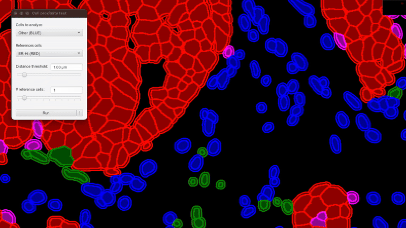
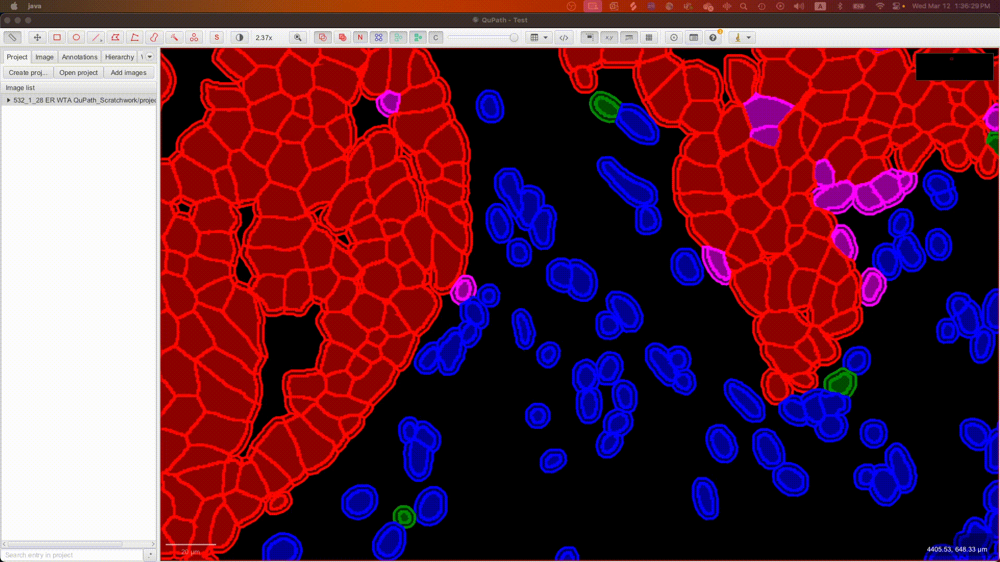
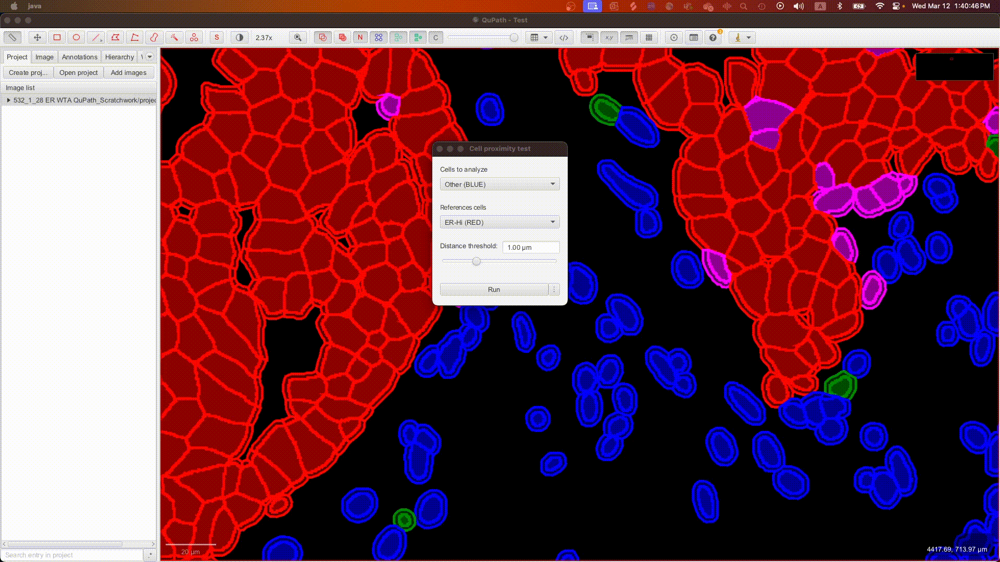
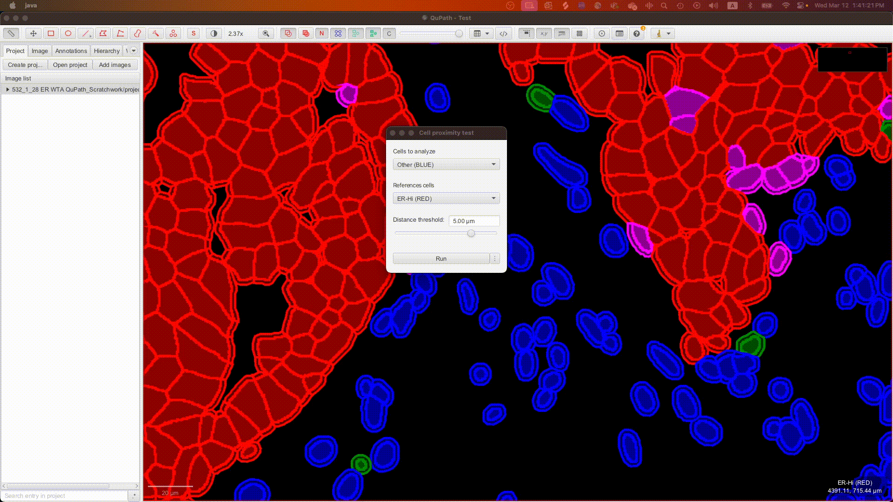
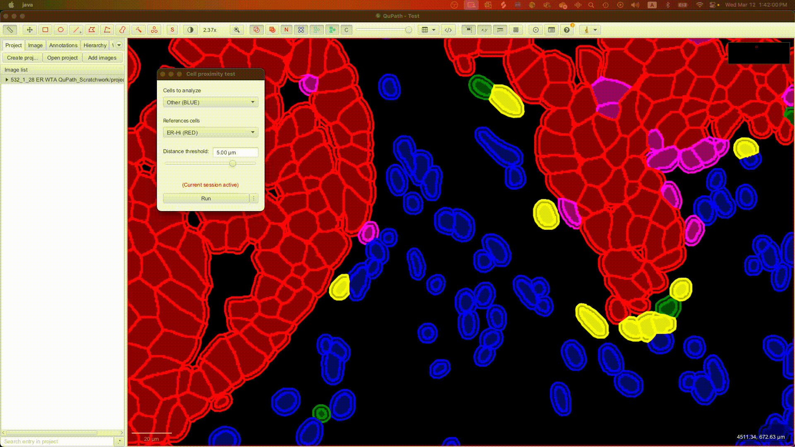
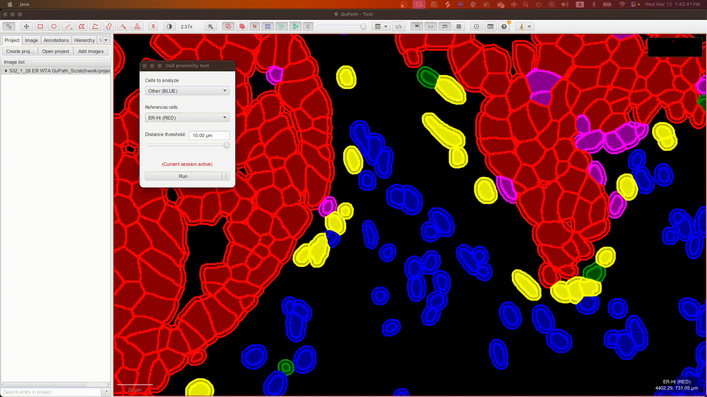
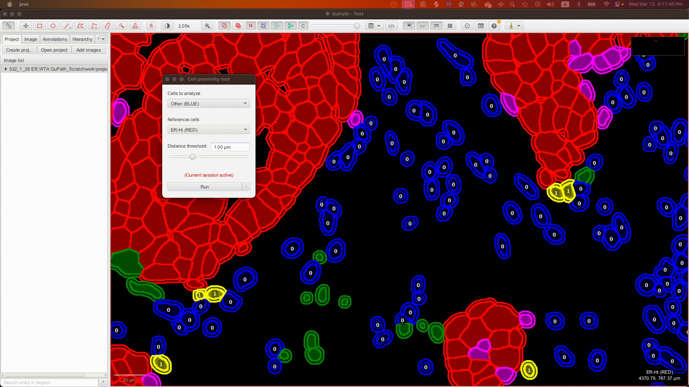
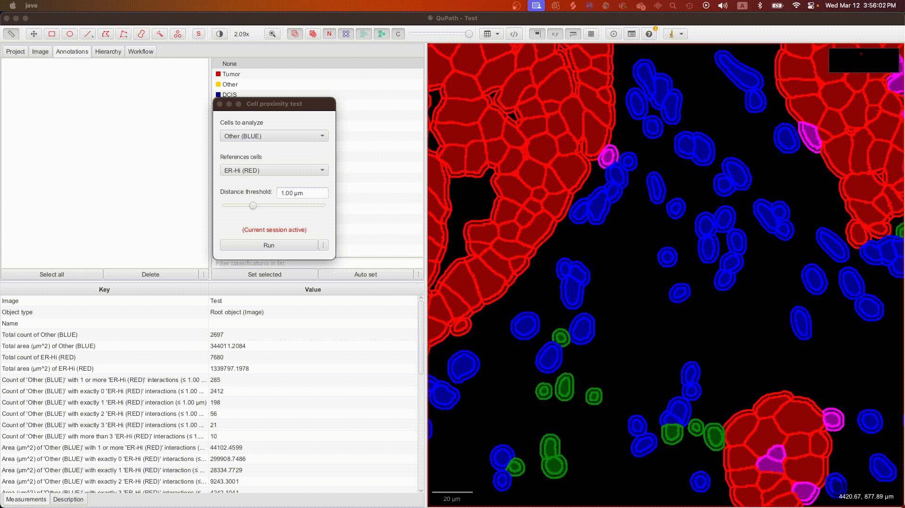

# QuPath Proximity Tools Extension

The Proximity Tools extension for [QuPath](https://qupath.github.io) enables cell-based proximity analysis including:

- Identifying cells near another set of cells.
- Visualizing cell proximities.
- Option to add proximity-based measurements (e.g., number of cells in proximity, mean nearest-neighbor distances, etc.).

This extension is compatible with all image types and is suited for analysis on tissue microarrays (TMAs) and whole tissue sections.

## Installing

Proximity Tools is supported in QuPath v0.5 or later. To install the extension, download the latest release and drag it onto the main QuPath window.
(Refer to the official QuPath documentation for more information about 
[installing extensions](https://qupath.readthedocs.io/en/latest/docs/intro/extensions.html).)

## Using the Proximity Tools Extension

Proximity Tools provides a graphical user interface (GUI) for quick and easy use. To get started, refer to the following sections:

- [Required Setup](#required-setup)
- [Running the Proximity Tools GUI](#running-the-proximity-tools-gui)
- [Adding and Viewing Measurements](#adding-and-viewing-measurements)

Additional use cases for more specialized needs are detailed in later sections.

### Required Setup

Proximity Tools requires an image loaded onto QuPath with existing classified cell objects. Refer to the official QuPath 
documentation for more information about [cell detections](https://qupath.readthedocs.io/en/stable/docs/tutorials/cell_detection.html) and
[cell classifications](https://qupath.readthedocs.io/en/stable/docs/tutorials/cell_classification.html).

### Running the Proximity Tools GUI

1. Navigate to `Extensions` > `Proximity Tools` > `Test cell proximities` to open the Proximity Tools GUI.
   
      
   
2. The GUI will automatically populate the choice boxes with existing cell classes, representing the cell 
populations available for analysis.
   - In the first choice box, select the desired cell population to analyze (i.e., target cell population). 
   - In the second choice box, select the desired reference cell population.

      

3. Set the distance threshold by using the slider or entering the value directly. The threshold defines the 
edge-to-edge distances between the target cells and reference cells for the analysis.
   - By default, the maximum allowed value for the distance threshold is 10 µm.

      

4. Click `Run` to start the analysis. (If TMA core objects are present, a prompt will appear confirming to
analyze them separately.)
   - Once the run is complete, a live session of the analysis will appear. The identified target cells
   within the distance threshold will be selected (and appear yellow) by default.

      

5. If desired, adjust the distance threshold in the current session to update the identified cells in
real time.

      

6. Toggle display features as needed using the `⋮` button:
   - `Show highlight...`: Selects the target cells within the distance threshold (on by default).
   - `Show labels...`: Adds labels to the target cells to indicate the number of reference cells within
   the distance threshold.
   - `Show connections...`: Show connecting lines between target and reference cells within the distance threshold.

     

> **Note:** For very large cell populations, enabling all display features simultaneously may cause latency.

### Adding and Viewing Measurements

Measurements can be added during live analysis sessions. Make sure to set the distance threshold to the
desired value, and then navigate to the `Add measurements...` from the `⋮` button. (If TMA core objects are present,
a prompt will appear confirming to add measurements by TMA cores instead of the full image.)

 

The measurements will be added to the image root object or TMA cores and include:
- Counts and areas of target cells within the distance threshold of at least one reference cell.
- Counts and areas of target cells within the distance threshold of exactly n reference cells
(up to 3 by default).
- Nearest-neighbor distance statistics (mean, median, standard deviation, and Weibull parameters) for 
nth nearest neighbors (up to 4 by default).

These measurements can be exported by navigating to `Measure` > `Export measurements` in QuPath.

 

Each target cell also gets nearest-neighbor distance measurements. These can be fully appreciated using QuPath's
histogram feature by locating `Measure` > `Show detection measurements` and enabling `Show histograms`, which can
be set to display the distribution of the nth nearest neighbor distances.

 

### Additional Features

#### Locking Changes
During a live session, you can use `⋮` > `Lock changes...` to finalize displayed labels and connections onto
the image.

#### Advanced Features
Enabling `⋮` > `Advanced Features...` will increase the distance threshold limit to 1000 µm and the nearest
neighbor search depth to n = 10. A `# reference cells` slider will also appear in the GUI, which can be used
in live sessions for selective highlighting of target cells with at least n reference cells within the distance
threshold. Double-click the `# reference cells` text field to toggle the function to highlight target cells with
_exactly_ n reference cells within the distance threshold.

 

### Scripting

Scripting can provide a flexible, scalable, and more powerful alternative to using the GUI. Navigate to `⋮` >
`Create script...` to generate a script template that replicates the current GUI setup.

Arguably the key benefit of scripting with Proximity Tools is the ability to adjust parameters that otherwise are 
limited in the GUI. (The generated script template includes comments explaining the parameters and code structure;
hopefully this can help you get started in making your own customizations.)

The official QuPath documentation has a [section on scripting](https://qupath.readthedocs.io/en/stable/docs/scripting/overview.html)
if you need additional guidance using the script editor.

 

### A Few 'Easter Eggs'

#### GUI Key Commands
- Toggle distance labels on connections: `Shift + N`
- Change currently displayed connection type:
  - Arrow: `Shift + Y`
  - Double arrow: `Shift + U`
  - Line: `Shift + I`
- Run modifications:
  - Analyze proximities by centroid instead of edge: `T + Click Run`

#### Custom Cell Definitions on the GUI
The Proximity Tools GUI does not normally enable defining cell populations beyond their classifications.
While scripting (see [Scripting](#scripting)) provides more flexibility, it lacks the benefits of real-time
analysis available in the GUI. To combine the best of both approaches, you can enable custom cell population
definitions in the GUI by doing the following:

1. Double-click the `Cells to analyze` or `Reference analyze` text field. A new window should open.
2. Enter a name for your custom cell population.
3. In the text area below, write a valid Groovy script that returns the collection of cells representing the
custom population. (The last line is inferred to be the return.)
4. Click `Confirm`.

 

## Citing

Please cite this GitHub repository if you found the extension helpful and are using it in your work!